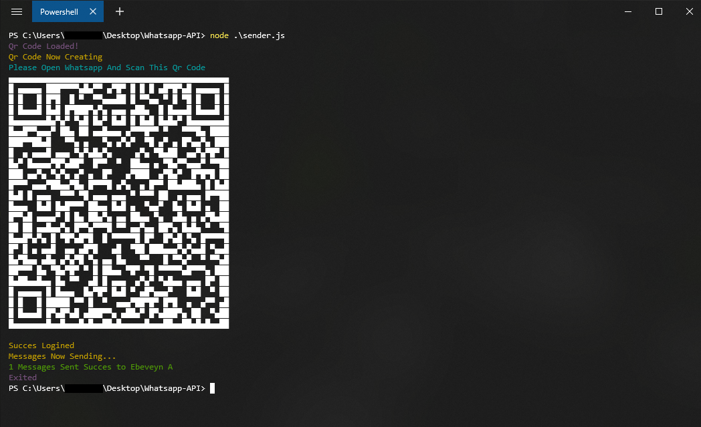

# Simple Whatsapp Message Api (BETA)
[](https://github.com/prettier/prettier)

This API is working with using the Web Driver [Puppeteer](https://github.com/puppeteer/puppeteer). You can send message and get your contact list on Whatsapp using this api. Note; That this project is in Beta, More API functions will be added in the future.  

## Install Requirements
Before use the api you need to install the requirements:
```bash
npm install puppeteer jssoup qrcode-terminal colors
```

## Example Usage
```javascript
const { whatsappUnofficialApi } = require("./whatsapp-unofficial-api");

(async () => {
  const client = new whatsappUnofficialApi();
  await client.services((save = false), (headless = true));
  await client.login((keep = false));
  await client.send_text(
    (user = "username or phone"),
    (message = "test message"),
    (range = 1)
  );
  //Examples; Username:Ebeveyn A, Phone:+905555555555
  await client.Exit((delay = 0), (waexit = true));
})();
```
Result:



## Parameters

This API has optional and required parameters:

```javascript
save // UserDataDir Create
headdless // Headless chrome
keep // Keep Signed In On Web Whatsapp       
user // User info
message // Message Text
range // Number of messages to be sent
delay // Wait before exit
waexit // Exit with click exit button on web whatsapp
```

## Saving Session Using UserDataDir

If you apply this method, you don't need to read qr code every time you send a message, first create Web Whatsapp logined UserDataDir:

```javascript
const { whatsappUnofficialApi } = require("./whatsapp-unofficial-api");

(async () => {
  const client = new whatsappUnofficialApi();
  await client.services((save = true), (headless = true));
  await client.login((keep = true));
  await client.Exit((delay = 0), (waexit = false));
})();
```

Now you can send message without read QrCode on every time:

```javascript
(async () => {
  const client = new whatsappUnofficialApi();
  await client.services((save = true), (headless = true));
  await client.savedlogin();
  await client.send_text("username or phone", "test message", 1);
  await client.Exit((delay = 0), (waexit = false));
})();
```
